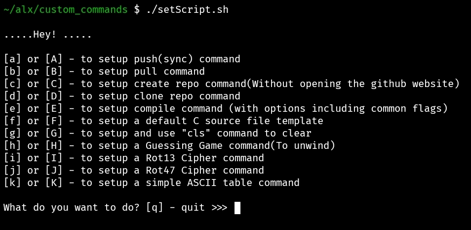

# Custom Commands

### Installation

Run `./setScript.sh` to install the various custom commands on your computer/phone such as:

 * push(sync) command
 * pull command
 * create repo a command(Without opening the github website)
 * clone repo a command
 * compile command (with options including common flags)
 * default C source file template command
 * cls command to clear
 * Github Author Identity(Global and Local) command
 * Guessing Game command(To unwind)
 * Rot13 Cipher command
 * Rot47 Cipher command
 * simple ASCII table command

### Usage

Depending on the command, the usage instruction for that command is provided after its successful installation.

# Changelog
This file contains the notable changes made to the Custom Commands project.

V1.0.1 (20-08-2023)
V1.0.0 (19-08-2023)
## New
	- Added command to configure Github Author Identity Global and/or Locally
	- Added sample screenshot of the menu when the script is executed
	- Added the git username and email feature locally to the create and clone repository commands (specific to the current working repository)
	- Added reminder to users not to create a repository within an existing repository
	- Added reminder to users not to clone into an existing repository
    - Added cls command to the list
	- Added quit option to push command
    - Moved the project to remote repository

## Changes 
	- Minor changes made to guessing game, rot13, rot47 and my ascii codes to enhance performance
	- clone and create repo commands now collect users information during installation
	- Changed the process of users having to open the clone and create repo scripts to manually input their details
    - Changed the simple ASCII table display
	- Changed default C template description
	- Removed emojis from Guessing game
	- Removed emojis from Rot47
	- Removed emojis from Rot13
	- Removed emojis from simple ASCII table

## Fixes
	- Repetition of codes in setscript has been removed to enhance robost performance 
	- Fixed and removed answer display before the start of the guessing game
	- Added execute permission for all user to the files.
    - Fixed response to wrong input entered by users during installation and command execution
    - Fixed option display to be limited to alphabets and not numbers
	- Removed repeated lines of codes that need not be

##### This is a collection of some of the programs that i have written so far since i joined ALX.
##### I believe automating some of the processes we carry out everyday when solving projects/tasks is essential for growth. Hence, the reason for sharing.

###### We Rise by Lifting Others.
