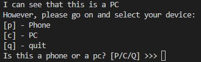
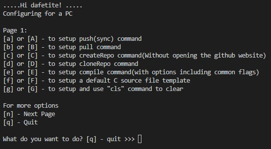
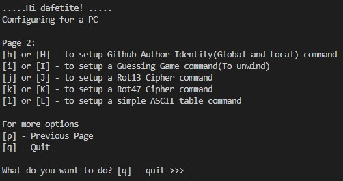

<p align="end">
  
</p>

# Custom Commands [](##)
[](#installation)

### Custom Commands is a modular, cross-platform command-line interface (CLI) toolkit designed to streamline and simplify daily development tasks across multiple programming stacks. Built with Shell, Python, and C, this utility offers a collection of ready-to-use automation scripts that accelerate workflows for web developers, system programmers, and CLI enthusiasts.

### Whether you're working with Git, building web apps in Django or React, compiling C code, or automating Python scripts, Custom Commands provides a unified interface to get things done faster — without repetitive boilerplate or constant context switching.

## Key Features
- ### Commands: Perform common Git, Django, React, Python, and C operations using short, memorable aliases.

- ### Workflow Automation: Eliminate repetitive tasks with modular shell scripts and logic-based CLI tools.

- ### Python CLI Utilities: Includes tools like Custom Commands, pycode, pyxecute, and ROT13 encoder/decoder.

- ### Django Development Toolkit: Auto-generate URLs, JWT/Djoser setups, migrations, and DRF configurations.

- ### React Utilities: Bootstrap projects, install dev dependencies, and manage packages with a single command.

- ### System Integration: Built to work seamlessly across Unix-based systems and Android (via Termux).

- ### Easy Installation: Just run setScript.sh to install and make commands globally accessible.

---
### Ideal For
- ### Developers looking to speed up their full-stack workflow.

- ### Students and freelancers needing a portable toolkit across machines.

- ### Terminal power users who prefer custom scripts over GUIs.
---
## Platforms
[](####)

- ### Unix, Linux, Windows Subsystem for Linux, Git Bash (Windows)

<br/><br/>





### Note: **You can view all your custom commands by running `custom_commands` on your terminal**

## Installation
[](########)


1. ### **Clone the repository:**
   ```bash
   git clone https://github.com/DafetiteOgaga/custom_commands.git
   ```
2. ### **cd into the repository:**
   ```bash
   cd custom_commands
   ```
3. ### **Then, run:**
   ```bash
   ./setScript.sh
   ```
<br>


## Usage
[](##########)

Depending on the command, the usage instruction for that command is provided after its successful installation.


### **After installation, you can access various commands on your computer or phone such as:**
[](.more/commands.md)


<br>

<table>
  <tr>
    <td><strong>Git commands</strong></td>
    <td><strong>Django commands</strong></td>
    <td><strong>Javascript commands</strong></td>
    <td><strong>Shell commands</strong></td>
    <td><strong>MySQL commands</strong></td>
    <td><strong>Betty command</strong></td>
    <td><strong>Python commands</strong></td>
    <td><strong>C commands</strong></td>
    <td><strong>MongoDB commands</strong></td>
  </tr>
  <tr>
    <td>push</td>
    <td>startproject</td>
    <td>createReactApp</td>
    <td>pyxecute</td>
    <td>mysqlOp</td>
    <td>betty</td>
    <td>py3venv</td>
    <td>ctemp</td>
    <td>mongoOp</td>
  </tr>
  <tr>
    <td>pull</td>
    <td>startapp</td>
    <td>dependencyDevReact</td>
    <td>shxecute</td>
    <td>mysqlversion</td>
    <td></td>
    <td>pycodemore</td>
    <td>mycompile</td>
    <td>mongoVersion</td>
  </tr>
  <tr>
    <td>pushfile</td>
    <td>runserver</td>
    <td>dependenciesReact</td>
    <td>jsxecute</td>
    <td>mysqlshell</td>
    <td></td>
    <td>pycode</td>
    <td>myascii</td>
    <td></td>
  </tr>
  <tr>
    <td>pushall</td>
    <td>makemigrations</td>
    <td>updateReactPackagez</td>
    <td>currfol</td>
    <td></td>
    <td></td>
    <td>pycompile</td>
    <td>rot13</td>
    <td></td>
  </tr>
  <tr>
    <td>createRepo</td>
    <td>migrate</td>
    <td>createExpoApp</td>
    <td>cls</td>
    <td></td>
    <td></td>
    <td></td>
    <td>rot47</td>
    <td></td>
  </tr>
  <tr>
    <td>deleteRepo</td>
    <td>requirement_txt</td>
    <td></td>
    <td>wcount</td>
    <td></td>
    <td></td>
    <td></td>
    <td>guessGame</td>
    <td></td>
  </tr>
  <tr>
    <td>cloneRepo</td>
    <td>drf</td>
    <td></td>
    <td>createPatch</td>
    <td></td>
    <td></td>
    <td></td>
    <td></td>
    <td></td>
  </tr>
  <tr>
    <td>restoreFile</td>
    <td>djoser</td>
    <td></td>
    <td>printmyEnv</td>
    <td></td>
    <td></td>
    <td></td>
    <td></td>
    <td></td>
  </tr>
  <tr>
    <td>viewRepos</td>
    <td>jwtDjango</td>
    <td></td>
    <td>setEnv</td>
    <td></td>
    <td></td>
    <td></td>
    <td></td>
    <td></td>
  </tr>
  <tr>
    <td>gitignore</td>
    <td>djangoToolbar</td>
    <td></td>
    <td>distributeApk</td>
    <td></td>
    <td></td>
    <td></td>
    <td></td>
    <td></td>
  </tr>
  <tr>
    <td>branch</td>
    <td>static4django</td>
    <td></td>
    <td></td>
    <td></td>
    <td></td>
    <td></td>
    <td></td>
    <td></td>
  </tr>
  <tr>
    <td>merge</td>
    <td>djshell</td>
    <td></td>
    <td></td>
    <td></td>
    <td></td>
    <td></td>
    <td></td>
    <td></td>
  </tr>
  <tr>
    <td>status</td>
    <td>mkandmigrate</td>
    <td></td>
    <td></td>
    <td></td>
    <td></td>
    <td></td>
    <td></td>
    <td></td>
  </tr>
  <tr>
    <td>revert2commit</td>
    <td>showmigrations</td>
    <td></td>
    <td></td>
    <td></td>
    <td></td>
    <td></td>
    <td></td>
    <td></td>
  </tr>
  <tr>
    <td>authorID</td>
    <td>sqlmigrate</td>
    <td></td>
    <td></td>
    <td></td>
    <td></td>
    <td></td>
    <td></td>
    <td></td>
  </tr>
  <tr>
    <td>commitree</td>
    <td>django</td>
    <td></td>
    <td></td>
    <td></td>
    <td></td>
    <td></td>
    <td></td>
    <td></td>
  </tr>
  <tr>
    <td>showDiff</td>
    <td>djangoUrls</td>
    <td></td>
    <td></td>
    <td></td>
    <td></td>
    <td></td>
    <td></td>
    <td></td>
  </tr>
  <tr>
    <td>commitdir</td>
    <td>collectstatic</td>
    <td></td>
    <td></td>
    <td></td>
    <td></td>
    <td></td>
    <td></td>
    <td></td>
  </tr>
  <tr>
    <td>commitall</td>
    <td></td>
    <td></td>
    <td></td>
    <td></td>
    <td></td>
    <td></td>
    <td></td>
    <td></td>
  </tr>
  <tr>
    <td>stash</td>
    <td></td>
    <td></td>
    <td></td>
    <td></td>
    <td></td>
    <td></td>
    <td></td>
    <td></td>
  </tr>
  <tr>
    <td>viewStash</td>
    <td></td>
    <td></td>
    <td></td>
    <td></td>
    <td></td>
    <td></td>
    <td></td>
    <td></td>
  </tr>
  <tr>
    <td>logit</td>
    <td></td>
    <td></td>
    <td></td>
    <td></td>
    <td></td>
    <td></td>
    <td></td>
    <td></td>
  </tr>
  <tr>
    <td>clear_commit</td>
    <td></td>
    <td></td>
    <td></td>
    <td></td>
    <td></td>
    <td></td>
    <td></td>
    <td></td>
  </tr>
  <tr>
    <td>showCommitHistory</td>
    <td></td>
    <td></td>
    <td></td>
    <td></td>
    <td></td>
    <td></td>
    <td></td>
    <td></td>
  </tr>
  <tr>
    <td>verifyRepo</td>
    <td></td>
    <td></td>
    <td></td>
    <td></td>
    <td></td>
    <td></td>
    <td></td>
    <td></td>
  </tr>
  <tr>
    <td>getRepoUserName</td>
    <td></td>
    <td></td>
    <td></td>
    <td></td>
    <td></td>
    <td></td>
    <td></td>
    <td></td>
  </tr>
  <tr>
    <td>updateToken</td>
    <td></td>
    <td></td>
    <td></td>
    <td></td>
    <td></td>
    <td></td>
    <td></td>
    <td></td>
  </tr>
  <tr>
    <td>pullFromMain</td>
    <td></td>
    <td></td>
    <td></td>
    <td></td>
    <td></td>
    <td></td>
    <td></td>
    <td></td>
  </tr>
  <tr>
    <td>showDiffOnMain</td>
    <td></td>
    <td></td>
    <td></td>
    <td></td>
    <td></td>
    <td></td>
    <td></td>
    <td></td>
  </tr>
  <tr>
    <td>deleteBranch</td>
    <td></td>
    <td></td>
    <td></td>
    <td></td>
    <td></td>
    <td></td>
    <td></td>
    <td></td>
  </tr>
  <tr>
    <td>forkRepo</td>
    <td></td>
    <td></td>
    <td></td>
    <td></td>
    <td></td>
    <td></td>
    <td></td>
    <td></td>
  </tr>

</table>

#### Note: For more details about the each commands.
[](.more/commands.md)


## Contributing
We welcome contributions!
Check out our [Contributing Guide](.github/CONTRIBUTING.md) to get started.

[](.github/CONTRIBUTING.md)


## New
  - forkRepo
  - deleteBranch
  - showDiffOnMain
  - pullFromMain
  - revert2commit
  - createExpoApp
  - createReactApp
  - updateToken

## Changes
  - pushfile command now displays additional option to inspect the changes in the currently processing file before staging and committing the changes to git
  - showDiff command can now take an argument (optional - filename/path_to_file) to inspect the changes made within that file
  - fixed pushfile command to now execute without argument, parsing through all the directories and subdirectories in the given repository and listing the modified, changed, new, deleted, etc files in-turns for staging and commiting before pushing only the committed changes to remote
  - createReactApp - changed the default tags within the head tag of index.html in /public/ to accomodate setup for seo, preview cards for social media, etc
  - pullFromMain command pulls (merges) changes from main/master branch and plays it in from of the changes from main/master into the current branch
  - merged mysqlstart, mysqlstop, mysqlrestart and mysql_status commands
   into mysqlOp command
  - [More](.more/changes.md)


## Fixes
  - fixed createRepo command to use a more robust template for its README.md file, verify repo name to comply with the github requirements.
  - fixed currfol command to now work across multiple platforms such as linux, wsl, gitbash, mac, etc
  - fixed base code to dynamically handle merge conflict for operations involving pull (from current branch), using rebase instead of merge resolution
  - Added checks to mongoOp command to check if mongodb is installed before proceeding with its operations
  - fixed all commands to be gitbash compartible
  - [More](.more/fixes.md)


## License
[](LICENSE)

This project is licensed under the [MIT License](LICENSE).


## Community
[](.github/CODE_OF_CONDUCT.md)

This project follows the [Contributor Covenant Code of Conduct](.github/CODE_OF_CONDUCT.md).
By participating, you are expected to uphold this code.


###### *We Rise by Lifting Others.*
