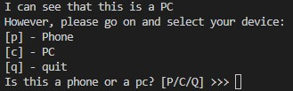
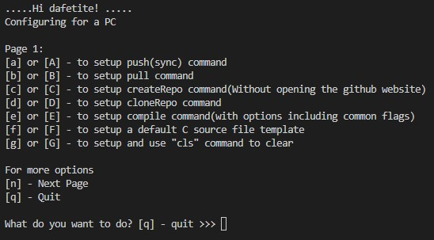
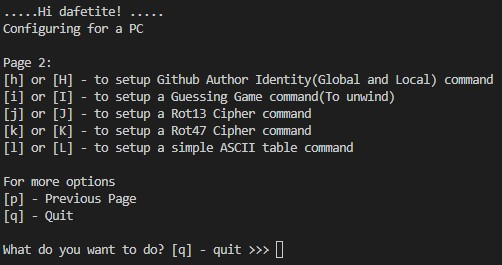

# Custom Commands





### Note: **You can view all your custom commands by running `custom_commands` on your terminal**

## Platforms
* Unix, Linux, Windows Subsystem for Linux, Git Bash (Windows)
<br><br>

# Installation

1. ### **Clone the repository:**
   ```bash
   git clone https://github.com/DafetiteOgaga/custom_commands.git
   ```
2. ### **cd into the repository:**
   ```bash
   cd custom_commands
   ```
3. ### **Then, run:**
   ```bash
   ./setScript.sh
   ```
<br>
<hr>

### **After installation you can access various commands on your computer/phone such as:**

<br>

<table>
  <tr>
    <td><strong>Git commands</strong></td>
    <td><strong>Django commands</strong></td>
    <td><strong>Javascript commands</strong></td>
    <td><strong>Shell commands</strong></td>
    <td><strong>MySQL commands</strong></td>
    <td><strong>Betty command</strong></td>
    <td><strong>Python commands</strong></td>
    <td><strong>C commands</strong></td>
    <td><strong>MongoDB commands</strong></td>
  </tr>
  <tr>
    <td>push</td>
    <td>startproject</td>
    <td>createReactApp</td>
    <td>pyxecute</td>
    <td>mysqlversion</td>
    <td>betty</td>
    <td>py3venv</td>
    <td>ctemp</td>
    <td>mongoOp</td>
  </tr>
  <tr>
    <td>pull</td>
    <td>startapp</td>
    <td>dependencyDevReact</td>
    <td>shxecute</td>
    <td>mysqlstartserver</td>
    <td></td>
    <td>pycodemore</td>
    <td>mycompile</td>
    <td></td>
  </tr>
  <tr>
    <td>pushfile</td>
    <td>runserver</td>
    <td>dependenciesReact</td>
    <td>jsxecute</td>
    <td>mysqlstopserver</td>
    <td></td>
    <td>pycode</td>
    <td>myascii</td>
    <td></td>
  </tr>
  <tr>
    <td>pushall</td>
    <td>makemigrations</td>
    <td>updateReactPackagez</td>
    <td>curfol</td>
    <td>mysqlrestartserver</td>
    <td></td>
    <td>pycompile</td>
    <td>rot13</td>
    <td></td>
  </tr>
  <tr>
    <td>createRepo</td>
    <td>migrate</td>
    <td>createExpoApp</td>
    <td>cls</td>
    <td>mysqlstatus_server</td>
    <td></td>
    <td></td>
    <td>rot47</td>
    <td></td>
  </tr>
  <tr>
    <td>deleteRepo</td>
    <td>requirement_txt</td>
    <td></td>
    <td>wcount</td>
    <td>mysqlshell</td>
    <td></td>
    <td></td>
    <td>guessGame</td>
    <td></td>
  </tr>
  <tr>
    <td>cloneRepo</td>
    <td>drf</td>
    <td></td>
    <td>createPatch</td>
    <td></td>
    <td></td>
    <td></td>
    <td></td>
    <td></td>
  </tr>
  <tr>
    <td>restoreFile</td>
    <td>djoser</td>
    <td></td>
    <td>printmyEnv</td>
    <td></td>
    <td></td>
    <td></td>
    <td></td>
    <td></td>
  </tr>
  <tr>
    <td>viewRepos</td>
    <td>jwtDjango</td>
    <td></td>
    <td>setEnv</td>
    <td></td>
    <td></td>
    <td></td>
    <td></td>
    <td></td>
  </tr>
  <tr>
    <td>gitignore</td>
    <td>djangoToolbar</td>
    <td></td>
    <td>distributeApk</td>
    <td></td>
    <td></td>
    <td></td>
    <td></td>
    <td></td>
  </tr>
  <tr>
    <td>branch</td>
    <td>static4django</td>
    <td></td>
    <td></td>
    <td></td>
    <td></td>
    <td></td>
    <td></td>
    <td></td>
  </tr>
  <tr>
    <td>merge</td>
    <td>djshell</td>
    <td></td>
    <td></td>
    <td></td>
    <td></td>
    <td></td>
    <td></td>
    <td></td>
  </tr>
  <tr>
    <td>status</td>
    <td>mkandmigrate</td>
    <td></td>
    <td></td>
    <td></td>
    <td></td>
    <td></td>
    <td></td>
    <td></td>
  </tr>
  <tr>
    <td>revert2commit</td>
    <td>showmigrations</td>
    <td></td>
    <td></td>
    <td></td>
    <td></td>
    <td></td>
    <td></td>
    <td></td>
  </tr>
  <tr>
    <td>authorID</td>
    <td>sqlmigrate</td>
    <td></td>
    <td></td>
    <td></td>
    <td></td>
    <td></td>
    <td></td>
    <td></td>
  </tr>
  <tr>
    <td>commitree</td>
    <td>django</td>
    <td></td>
    <td></td>
    <td></td>
    <td></td>
    <td></td>
    <td></td>
    <td></td>
  </tr>
  <tr>
    <td>compareChange</td>
    <td>djangoUrls</td>
    <td></td>
    <td></td>
    <td></td>
    <td></td>
    <td></td>
    <td></td>
    <td></td>
  </tr>
  <tr>
    <td>commitdir</td>
    <td>collectstatic</td>
    <td></td>
    <td></td>
    <td></td>
    <td></td>
    <td></td>
    <td></td>
    <td></td>
  </tr>
  <tr>
    <td>commitall</td>
    <td></td>
    <td></td>
    <td></td>
    <td></td>
    <td></td>
    <td></td>
    <td></td>
    <td></td>
  </tr>
  <tr>
    <td>stash</td>
    <td></td>
    <td></td>
    <td></td>
    <td></td>
    <td></td>
    <td></td>
    <td></td>
    <td></td>
  </tr>
  <tr>
    <td>viewStash</td>
    <td></td>
    <td></td>
    <td></td>
    <td></td>
    <td></td>
    <td></td>
    <td></td>
    <td></td>
  </tr>
  <tr>
    <td>logit</td>
    <td></td>
    <td></td>
    <td></td>
    <td></td>
    <td></td>
    <td></td>
    <td></td>
    <td></td>
  </tr>
  <tr>
    <td>clear_commit</td>
    <td></td>
    <td></td>
    <td></td>
    <td></td>
    <td></td>
    <td></td>
    <td></td>
    <td></td>
  </tr>
  <tr>
    <td>show</td>
    <td></td>
    <td></td>
    <td></td>
    <td></td>
    <td></td>
    <td></td>
    <td></td>
    <td></td>
  </tr>
  <tr>
    <td>verifyRepo</td>
    <td></td>
    <td></td>
    <td></td>
    <td></td>
    <td></td>
    <td></td>
    <td></td>
    <td></td>
  </tr>
  <tr>
    <td>getRepoUserName</td>
    <td></td>
    <td></td>
    <td></td>
    <td></td>
    <td></td>
    <td></td>
    <td></td>
    <td></td>
  </tr>
  <tr>
    <td>updateToken</td>
    <td></td>
    <td></td>
    <td></td>
    <td></td>
    <td></td>
    <td></td>
    <td></td>
    <td></td>
  </tr>

</table>

#### Note: For more details about the each commands. [click me](https://github.com/DafetiteOgaga/custom_commands/blob/master/commands.md)

<hr>

### Usage

#### Depending on the command, the usage instruction for that command is provided after its successful installation.
<hr>

### Contributing
#### I welcome contributions from the community! If you'd like to contribute to Custom commands, please follow these steps:

- Fork this repository.
- Create a new branch for your feature or bug fix.
- Commit your changes and push to your fork.
- Submit a pull request to this repository.

## New
  - mongoOp
  - revert2commit
  - createExpoApp
  - createReactApp
  - setEnv
  - djangoUrls
  - updateToken
  - djangoToolbar
  - drf

## Changes
  - changed rollback to revert2commit command, which is preferred because
   it reverts to any earlier commit state and still keeps the commit history by undoing all the changes made upto the selected commit and
   creating a new commit for this revert. Hence, history is not lost or
   discarded
  - Added (New) createExpoApp - uses backed up app config setup to create apps after the initial (first downloaded) setup and spins up the local server automatically.
   - Added (New) setEnv command - creates environmental variables automatically.
   - Added collectstatic command - collects static files in django for production.
  - Added support for urls display to startproject command when creating a new django project. install and run djangoUrls command to see the list and details of all configured urls.
  - createReactApp now downloads the configs for CRA on first use, then uses this config for subsequent use while it updates itself whenever there is an update to CRA config
  - [More](https://github.com/DafetiteOgaga/custom_commands/blob/master/changes.md)


## Fixes
  - fixed all commands to be gitbash compartible
  - fixed updateResumeCV command to automatically update concerned repos locally after execution.
  - Added support for ignoring node_modules using gitignore command for Expo (React Native) Apps.
  - corrrected typos in createReactApp command setup.
  - handled the case where a user tries to install and configure a django project without initially installing an app
  - fixed the DRF module error for runserver, sqlmigrate commanda
  - [More](https://github.com/DafetiteOgaga/custom_commands/blob/master/fixes.md)


###### *We Rise by Lifting Others.*
